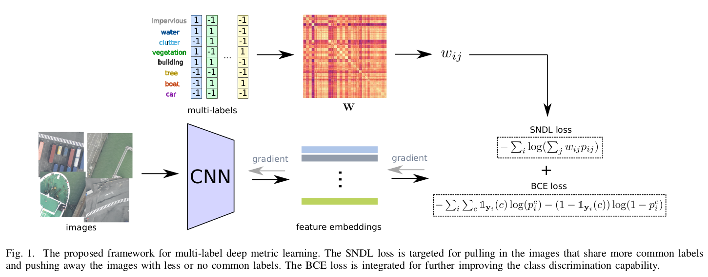

# Graph Relation Network: Modeling Relations between Scenes for Multi-Label Remote Sensing Image Classification and Retrieval

[Jian Kang](https://github.com/jiankang1991), [Ruben Fernandez-Beltran](https://scholar.google.es/citations?user=pdzJmcQAAAAJ&hl=es),[Danfeng Hong](https://sites.google.com/view/danfeng-hong), [Jocelyn Chanussot](http://www.gipsa-lab.grenoble-inp.fr/~jocelyn.chanussot/), [Antonio Plaza](https://www.umbc.edu/rssipl/people/aplaza/)
---

This repo contains the codes for the TGRS paper: [Graph Relation Network: Modeling Relations between Scenes for Multi-Label Remote Sensing Image Classification and Retrieval](https://www.umbc.edu/rssipl/people/aplaza/Papers/Journals/2020.TGRS.GRN.pdf). We propose a new graph relation network (GRN) for multi-label RS scene categorization. Our GRN is able to model the relations between samples (or scenes) by making use of a graph structure which is fed into network learning. For this purpose, we define a new loss function called scalable neighbor discriminative loss with binary cross entropy (SNDL-BCE), that is able to embed the graph structures through the networks more effectively. The proposed approach can guide deep learning techniques (such as convolutional neural networks) to a more discriminative metric space, where semantically similar RS scenes are closely embedded and dissimilar images are separated from a novel multi-label viewpoint. To achieve this goal, our GRN jointly maximizes a weighted leave-one-out K-nearest neighbors (KNN) score in the training set, where the weight matrix describes the contributions of the nearest neighbors associated with each RS image on its class decision, and the likelihood of the class discrimination in the multi-label scenario.





## Usage

`./train_SNDL/main.py` is the training script for GRN-SNDL.

`./train_SNDL_BCE/main.py` is the training script for GRN-SNDL-BCE.

## Citation

```
@article{kang2020grn,
  title={Graph Relation Network: Modeling Relations between Scenes for Multi-Label Remote Sensing Image Classification and Retrieval}},
  author={Kang, Jian and Fernandez-Beltran, Ruben and Hong, Danfeng and Chanussot, Jocelyn and Plaza, Antonio},
  journal={IEEE Transactions on Geoscience and Remote Sensing},
  year={2020},
  note={DOI:10.1109/TGRS.2020.3016020}
  publisher={IEEE}
}
```

## References

[1] Wu, Zhirong, Alexei A. Efros, and Stella X. Yu. "Improving generalization via scalable neighborhood component analysis." Proceedings of the European Conference on Computer Vision (ECCV). 2018.

